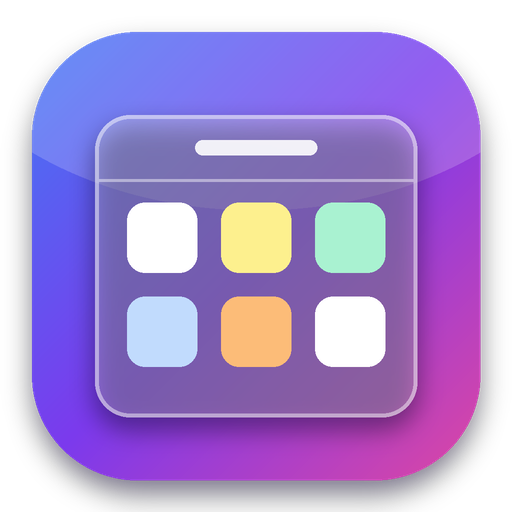
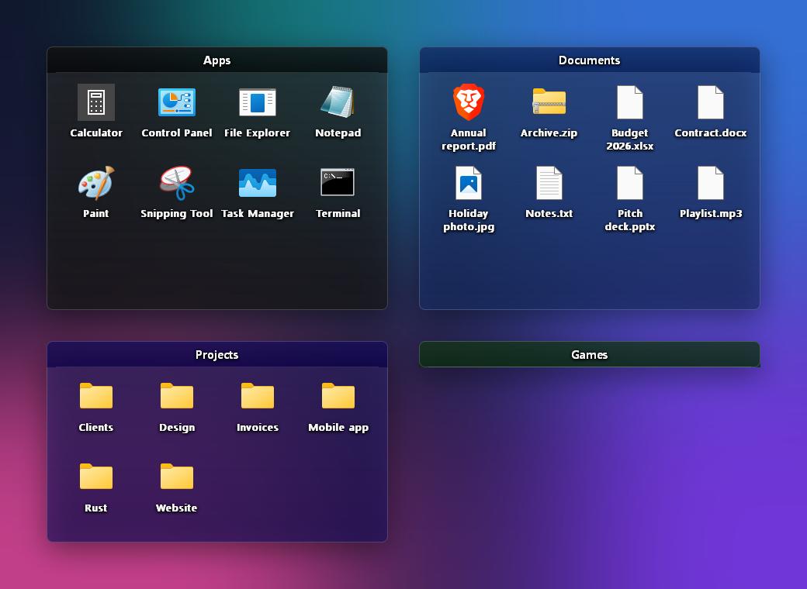

<p align="center"></p>

<h1 align="center">Rust Desktop Icons</h1>

<p align="center"><b>A free, open-source alternative to Fences 6, written entirely in Rust.</b><br>
Organize your Windows desktop into beautiful, translucent groups of icons. Tiny, fast, private.</p>

<p align="center">
  <a href="https://github.com/vincentxjoubert-lang/rust-desktop-icons/releases/latest"></a>
  <a href="https://github.com/vincentxjoubert-lang/rust-desktop-icons/releases"></a>
  <a href="https://github.com/vincentxjoubert-lang/rust-desktop-icons/stargazers"></a>
  <br>
  <a href="https://github.com/vincentxjoubert-lang/rust-desktop-icons/actions/workflows/ci.yml"></a>
  
  
  <a href="LICENSE"></a>
</p>

<p align="center">
  <a href="https://github.com/vincentxjoubert-lang/rust-desktop-icons/releases/latest"><b>⬇ Download for Windows</b></a>
</p>

<p align="center"></p>

## Why Rust Desktop Icons?

|  |  |
| --- | --- |
| 🪟 **Translucent fences** | Rounded, semi-transparent groups that sit on your desktop, behind every window |
| 🎨 **Make it yours** | Any color, opacity from 30 to 100 %, rename, resize, roll up to the title bar |
| 🖱️ **Drag & drop anything** | Desktop icons move in; apps from the Start menu, Public Desktop or anywhere else become shortcuts |
| ⚡ **Smooth and light** | Native Win32 + Rust, no runtime, no web view; moving or resizing never reloads icons |
| 🌍 **25 languages** | Auto-detected from Windows, switchable from the tray menu |
| 🔄 **Silent updates** | Checks GitHub Releases, verifies SHA-256, installs in the background |
| 🔒 **Private** | No account, no telemetry, no ads; the only network call is the update check |
| 👤 **No admin needed** | Per-user installer, optional start with Windows |

## Install

1. Download `rust-desktop-icons-x.y.z-x64.msi` from the [latest release](https://github.com/vincentxjoubert-lang/rust-desktop-icons/releases/latest).
2. Run it. The app starts right away and adds an icon next to the clock.

> The installer is not code-signed yet, so SmartScreen may warn you: click **More info → Run anyway**.
> Each release ships a `.sha256` file: compare it with `Get-FileHash .\rust-desktop-icons-*.msi`.

## Usage

| Action | How |
| --- | --- |
| Create a fence | Tray icon → **New fence**, or right-click inside a fence |
| Add icons | Drag them onto a fence (from the desktop, Start menu, Explorer…) |
| Open an item | Double-click it |
| Rename a fence | Right-click its title |
| Move / resize | Drag the title bar / drag an edge |
| Roll up / down | Double-click the title bar |
| Color, opacity, delete | Right-click inside the fence |
| Put an item back | Right-click it → **Move to desktop** |
| Scroll | Mouse wheel over a fence |

Files from your own desktop are **moved** into `%LOCALAPPDATA%\RustDesktopIcons\fences\<id>` (never deleted).
Anything else gets a **shortcut**, so the original stays where it is. Deleting a fence moves its items back to the desktop.

## Languages

English, 中文, हिन्दी, Español, Français, العربية, বাংলা, Português, Русский, اردو, Bahasa Indonesia, Deutsch, 日本語,
Kiswahili, मराठी, తెలుగు, Türkçe, தமிழ், Tiếng Việt, 한국어, Italiano, ไทย, Polski, Українська, فارسی.

Native speakers: corrections are welcome in [`src/i18n.rs`](src/i18n.rs).

## Updates and security

- Every 6 hours (first check 30 s after start) the app asks the GitHub API for the latest release.
- A newer `.msi` and its `.sha256` are downloaded **only** from this repository's release URLs over HTTPS; the hash
  must match before `msiexec /qn` runs. The installer then restarts the app.
- Disable it from the tray menu (**Automatic updates**).
- Only documented Windows APIs are used. Dependencies are scanned with `cargo audit` before each release.

## Build from source

```powershell
cargo test
cargo build --release
dotnet tool install --global wix --version 5.0.2
wix build installer/main.wxs -d Version=0.4.0 -arch x64 -o rust-desktop-icons.msi
```

Pushing a `vX.Y.Z` tag builds and publishes the MSI with [GitHub Actions](.github/workflows/release.yml).

## Architecture

| Module | Role |
| --- | --- |
| `domain.rs` | Pure model and rules: fences, config validation, layout grid, hit zones, colors |
| `render.rs` | Pure pixel compositing: premultiplied alpha, anti-aliased rounded rectangles, gradients, blur |
| `store.rs` | Config persistence (atomic write) and safe file moves |
| `i18n.rs` | 25-language string table and locale resolution |
| `update.rs` | Release check, download, SHA-256 verification, silent install |
| `app.rs` | Application state, tray icon and menu, update scheduling |
| `fence.rs` | Fence window: rendering, hit-testing, drag & drop, context menu |
| `shell.rs`, `win.rs` | Thin wrappers over the Windows Shell (icons, shortcuts, folder watch), registry and Win32 |

## Known limitations

- Items are dragged out of a fence with the context menu (**Move to desktop**), not drag & drop yet.
- No background blur: Windows only offers it for active windows, and fences are never active.
- **Before uninstalling**, delete your fences so their items go back to the desktop. Uninstalling never deletes your
  files: anything left stays in `%LOCALAPPDATA%\RustDesktopIcons\fences`.

## License

[MIT](LICENSE). Not affiliated with Stardock; "Fences" is a trademark of its respective owner.
